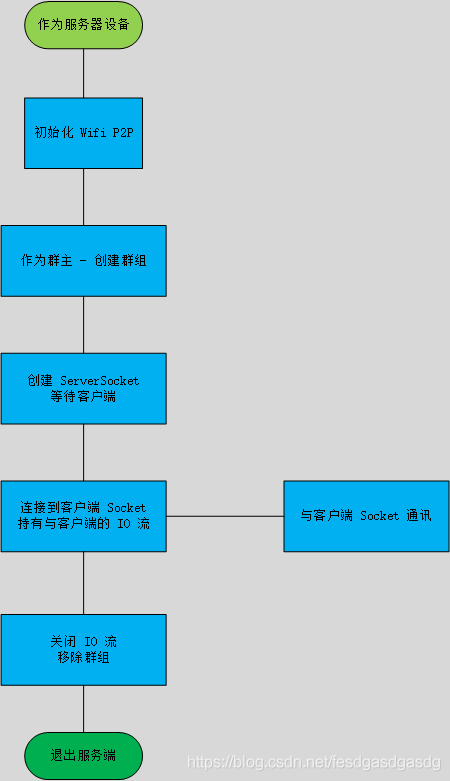
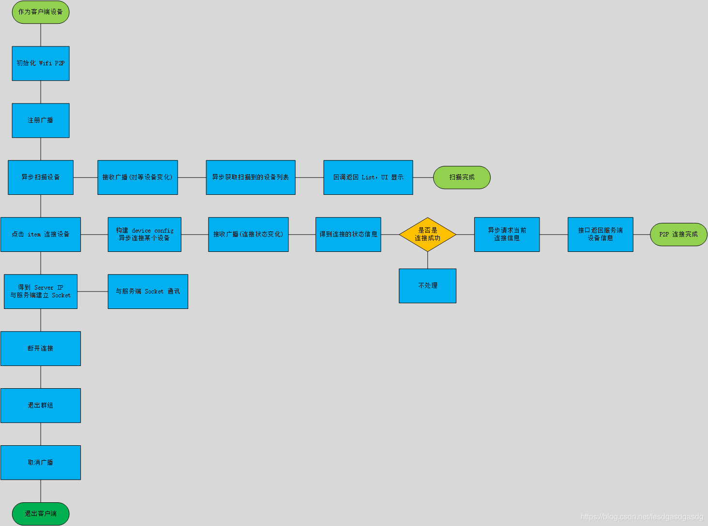
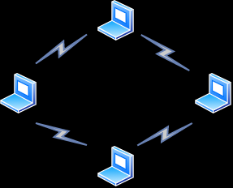
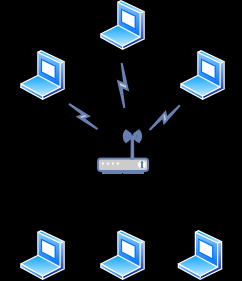

## https://blog.csdn.net/fesdgasdgasdg/article/details/106559510

Wifi P2P (peer to peer)：也为 Wifi 点对点，也叫 Wifi 直连(Wifi Direct)，它是 Wifi Display(投屏) 应用的技术基础。

## WLAN 直连 (P2P) 技术
使用 WLAN 直连 (P2P) 技术，可以让具备相应硬件的 Android 4.0（API 级别 14）或更高版本设备在没有中间接入点的情况下，
通过 WLAN 进行直接互联。使用这些 API，您可以实现支持 WLAN P2P 的设备间相互发现和连接，从而获得比蓝牙连接更远距离
的高速连接通信效果。对于多人游戏或照片共享等需要在用户之间共享数据的应用而言，这一技术非常有用。

总结以下优点：
1、有比蓝牙更远的传输距离。
2、有比蓝牙更快速的数据传输速度，更大的带宽。
3、只需要打开 Wifi 即可，不需要加入任何网络或 AP，即可实现对等点连接通讯。
可实现通过 Wifi 连接，同时使用数据网络的场景，比喻：手机遥控无人机的同时，无人机需要访问远程服务器上传数据。

## Wifi P2P 架构：
虽然上面提到两台或多台 Android 设备通过 Wifi P2P 通讯时不需要加入任何网络，但是 Wifi P2P 协议还是需要组件网络
才能发现对方并建立 TCP 连接通讯的。在组网和通讯阶段一共有 3 个角色：

1、P2P Group Owner，或称为群主，充当服务端，并需要创建 ServerSocket 等待客户端的连接，获得 IO 流与客户端通讯
或转发消息给其他客户端。

2、P2P Client，或称为组员，充当客户端，需要创建 Socket 与服务器通讯。

3、P2P Device，在上面的过程中，服务器端和客户端都是一个独立的设备，拥有唯一的设备特征信息。

4、广播接收器：
WifiP2pManager.WIFI_P2P_STATE_CHANGED_ACTION：检查 Wi-Fi P2P 是否已启用。Android 4.0 以上系统才有此功能。

WifiP2pManager.WIFI_P2P_PEERS_CHANGED_ACTION：对等设备发生变化，一般是在调用 discoverPeers 方法后发送此广播。
在此广播中，你可以调用 requestPeers 方法，获得扫描到的对等设备列表。

WifiP2pManager.WIFI_P2P_CONNECTION_CHANGED_ACTION：连接状态发生变化，一般在调用 connect 或 cancelConnect 方法
时会发送此广播。状态共有 5 种：WifiP2pDevice.AVAILABLE、WifiP2pDevice.INVITED、WifiP2pDevice.CONNECTED、
WifiP2pDevice.FAILED 和 WifiP2pDevice.UNAVAILABLE 。

当判断连接信息为连接状态时，即 networkInfo.isConnected() ，你应当继续请求连接的具体信息 
mManager.requestConnectionInfo(...)，然后获得群主的详细设备信息，建立 Socket 通讯。

WifiP2pManager.WIFI_P2P_THIS_DEVICE_CHANGED_ACTION：此设备的WiFi状态更改回调，应用可使用 requestDeviceInfo() 来
检索当前连接信息。

在未组网之前，是不存在群主、组员之称的。只有在设备尝试发现并连接对方时，系统才会通过 P2P 协议尝试使多端设备
组件为一个群组，并自动确定某一个设备为群主。但是本人在实测过程中发现，是需要先有群主，才会加入组员组网通讯的。

连接流程：
绘制了一张流程图，描述我 Demo 的连接过程。
服务端流程：

客户端流程：

---------------------------------------------
# 1.WiFi热点数据传输--Socket通信
首先，描述下功能，两个手机，其中一个手机开热点，另外一个手机连接热点，2个手机间数据通信（不需要流量）。
简述一下原理：开热点的手机相当于路由器，连接的手机作为客户端，获取路由器的IP建立Socket 连接，开始双方通信。

# 2.wifi direct P2P 直连
WFA定义的P2P协议文档全名为“Wi-Fi Peer-to-Peer（P2P） Technical Specification”。

P2P技术使得多个Wi-Fi设备在没有AP的情况下也能构成一个网络（P2P Network，也被称之为P2P Group）并相互通信。
AP(无线访问接入点(WirelessAccessPoint))，热点。

Wi-Fi P2P技术是Wi-Fi Display（也称之为Miracast，详情请参考作者的一篇博文http://blog.csdn.net/innost/article/details/8474683）的基础。
在Miracast应用场景中，一台支持P2P的智能手机可直接连接上一台支持P2P的智能电视，智能手机随后将自己的屏幕，或者
媒体资源传送给电视机去显示或播放。显然，借助P2P技术，Wi-Fi设备之间的直接相连将极大拓展Wi-Fi技术的使用场景。

# 3.WLAN 与 WiFi
WLAN 的全称为 Wireless Local Area Networks中文意思为无线局域网络，是一种数据传输系统。它是利用射频技术进行数据传输，
以此来实现通信和共享资源的网络体系。

目前WLAN通用的标准IEEE是802.11系列标准使用的是 5GHz 频段以及 2.4GHz，在 IEEE802.11a 时使用 5GHZ 频段下支持的最大速度
为54Mbps;在 IEEE 802.11b 和IEEE 802.11g 时使用 2.4GHz 下支持的最大速度分别为 11Mbps.54Mbpso

WiFi 的全称为 Wireless Fidelity，中文意思为无线保真，是一个创建于 IEEE 802.11 标准的无线局域网技术，这种技术改善了基
于 IEEE 802.11标准的无线网络产品之间的互通性。

WLAN包括了WiFi和WAPI两项技术。
WLAN 的电波覆盖范围较广，适用于区域范围更广的场所，比如学校、机场等公共区域;
wiFi 的覆盖范围较小，适用于办公室、家里等空间较小的区域。

# 4.WLAN 有几种拓扑结构？
WLAN 的拓扑结构分为两种，一种是终端之间直接互连的 ad-hoc 模式，另一种是通过 AP 连接有线网络的基础设施模式。

ad-hoc 模式，全称 ad-hoc mode ，即 IEEE 802.11 无线网络的 BSS ，在两台 STA 之间直接进行无线通信，而组成的网络，
也叫做点对点的网络模式。通常是笔记本电脑和打印机进行无线连接或多台游戏机进行联机对战时使用。终端一般配置了无线
网卡。这个模式下，终端是不能连接到互联网上的。

基础设施模式，全称 Infrastructure Mode ，是指 802.11 无线网络的 BSS 形式组网，通常是通过 AP 连接到互联网时使用。
在这个模式下，除了有 STA 外，还需要有 AP 才能连接到互联网。

# 5.其他
外接USB 4G WIFI 蓝牙 NFC

外接USB扫描枪
条码扫描枪即插即用，读取的数据会经过扫描枪处理转换成符合主机软件要求的数据格式，不用安装任何驱动，使用就像
电脑配件:键盘，鼠标以及U盘一样简单。条码扫描枪主要有三种接口：键盘接口，USB接口，RS232串口。

Android连接打印机：WIFI

投屏的应用场景

